# Terraform and Oracle OCI Resource Manager practice LAB

# https://github.com/oracle/terraform-provider-oci/tree/master/examples

## Introduction

Resource Manager is an Oracle Cloud Infrastructure service that allows you to automate the process of provisioning your Oracle Cloud Infrastructure resources. Using Terraform, Resource Manager helps you install, configure, and manage resources through the "infrastructure-as-code" model.  


### Objective  

This is a series of practice examples using terraform and OCI resource manager stack to demonstrate how these tecnologies works on a LAB environment.

### Prerequisites

* Provide the following:  
   - Oracle account with admin level access permissions
   - A compartment to create your resources
   - Local OCI-CLI setup, if you need help, check the [Installing the CLI tutorial](https://docs.oracle.com/en-us/iaas/Content/API/SDKDocs/cliinstall.htm)
   - Local Terraform install, if you need help, check the [Install Terraform tutorial](https://developer.hashicorp.com/terraform/tutorials/oci-get-started/install-cli)


## Example 1: Create and destroy a simple VCN using local Terraform CLI

   
   ```
    #Initialize the directory by running the command:  
    terraform init
   ```

   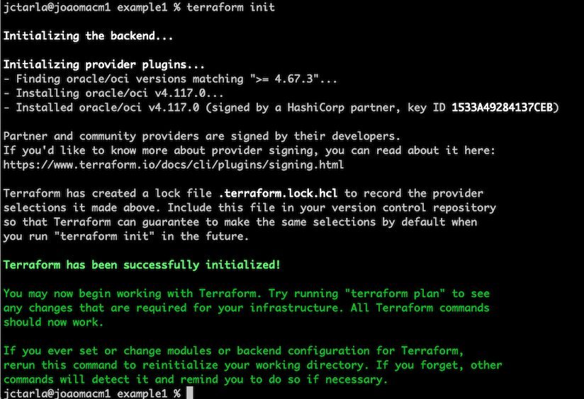
   
   ```
    #Format and validate the configuration  
    terraform fmt
    terraform validate 
   ```

   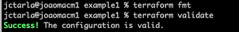
  

   ```
    # Run the APPLY command to check and confirm the apply  
    terraform apply
   ```

   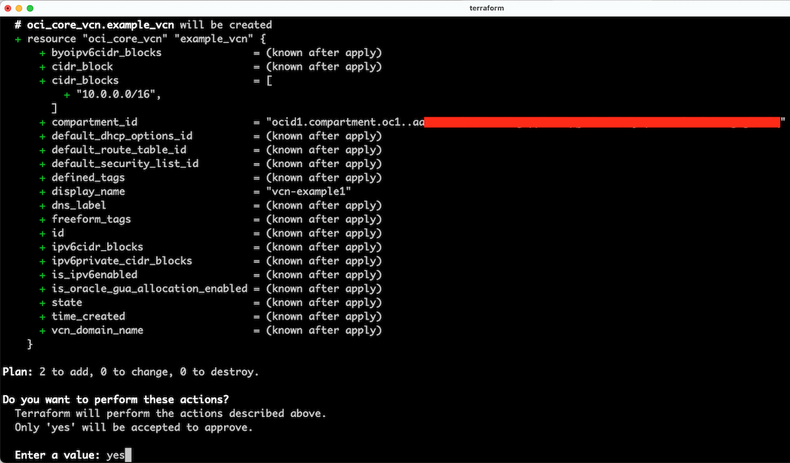
   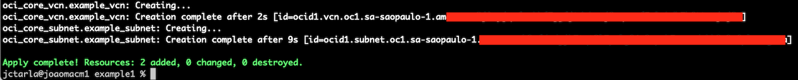
   
   
   Go to your OCI Console for **Virtual Cloud Netrowks** and check the VCN was created.  

   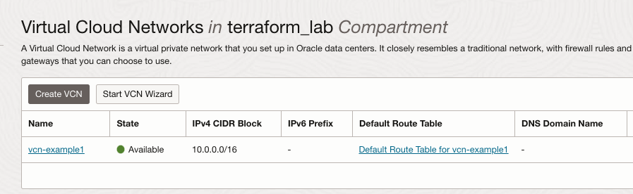
   
   Destroy the created VCN by running the command:  

   ```
    terraform destroy
   ```

   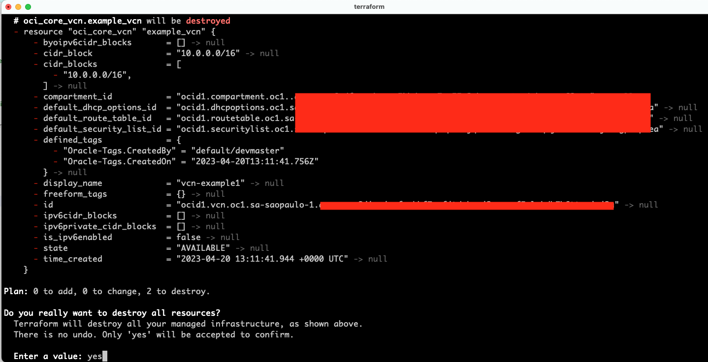
   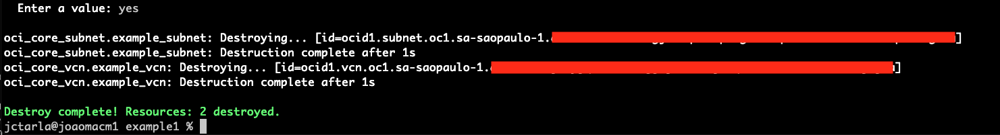  
   


## Example 2: Deploy a full Oracle Container Engine (OKE) cluster using Resource Manager
  - From the root directory, go to the example 2 directory :  

  ```
   cd files/example2/
   ls -lrt 
  ```

  - Edit the **vars_to_stack.json** file and add your values for variables:  

  ```
   {"compartment_ocid": "ocid1.compartment.oc1..xxxxx",
     "region": "us-ashburn-1",
     "tenancy_ocid": "ocid1.tenancy.oc1..xxxx",
     "user_ocid": "",
     "fingerprint": "",
     "private_key_path": ""
   }
  ```

  - Create your ZIP package with all terraform files  

  ```
    zip oke_package.zip *.tf
    ls -lrt *.zip
  ``` 

  - Create the new resource manager stack using OCI CLI:  

  ``` 
   export COMPARTMENT_ID="place_your_compartment_id_here"
   oci resource-manager stack create --compartment-id $COMPARTMENT_ID --config-source ./oke_package.zip --variables file://vars_to_stack.json --display-name "NewOKE-Terraform" --description "New OKE cluster from terraform" --working-directory ""

  ```
  - Run the **Apply** JOB using OCI CLI:  

  ``` 
   export stack_id="replace_with_your_stack_id_from_earlier_step" 

   echo "Creating Plan Job"
   CREATED_PLAN_JOB_ID=$(oci resource-manager job create-plan-job --stack-id $stack_id --wait-for-state SUCCEEDED --query 'data.id' --raw-output)
   echo "Created Plan Job Id: ${CREATED_PLAN_JOB_ID}"

   echo "Creating Apply Job"
   CREATED_APPLY_JOB_ID=$(oci resource-manager job create-apply-job --stack-id $stack_id --execution-plan-strategy FROM_PLAN_JOB_ID --execution-plan-job-id "$CREATED_PLAN_JOB_ID" --query 'data.id' --raw-output)
   echo "Created Apply Job Id: ${CREATED_APPLY_JOB_ID}"

   # To check the logs, you can run this: 
   oci resource-manager job get-job-logs --job-id $CREATED_APPLY_JOB_ID 
  ```
 
 - To **destroy** the created resources, you can run the DESTROY JOB using OCI CLI:  

 ```  
  echo "Creating Destroy Job"
  CREATED_DESTROY_JOB_ID=$(oci resource-manager job create-destroy-job --stack-id $stack_id --execution-plan-strategy=AUTO_APPROVED --query 'data.id' --raw-output)
  echo "Created Destroy Job Id: ${CREATED_DESTROY_JOB_ID}"
 ```


## Example 3: Using Resource Manager tied to a GitHub repository 

 - In your Oracle Cloud console, go to **Developer Services**, **Resource Manager** and click on **Stacks**  
   Create a new Stack and select option **Source code control system**, this will allow you to connect to your github repository and get all the terraform files.  

   Select the configuration source provider and click on **Create configuration source provider**

   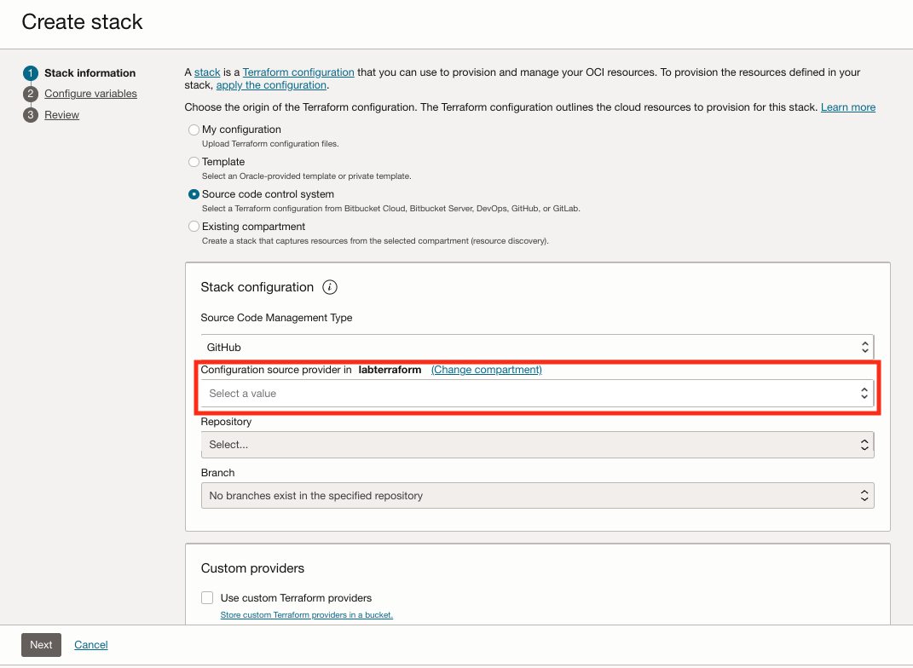
    
   Note: You need to create an **access token** on your GitHub account settings.  

   You can clone this public repository with the Lab terraform example:[Github Example Terraform](https://github.com/jctarla/my-vnc-terraform)  
   

   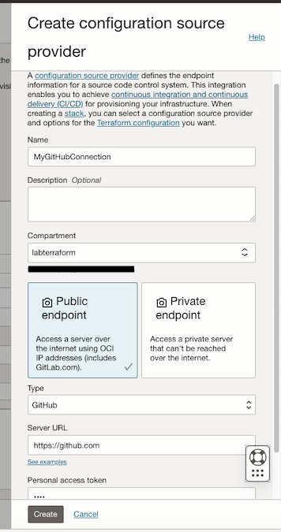
    
   Fill with your repository information and then click on **Create**  

   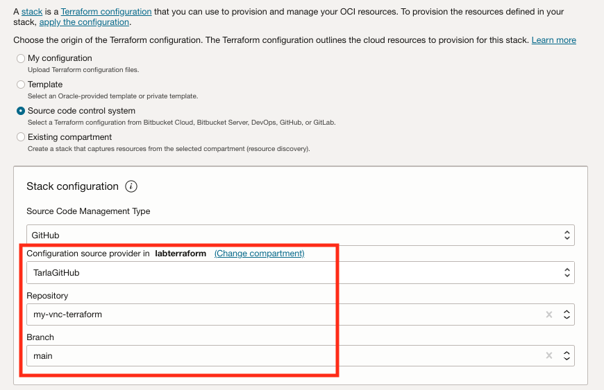
   
   The stack was created:  
    
   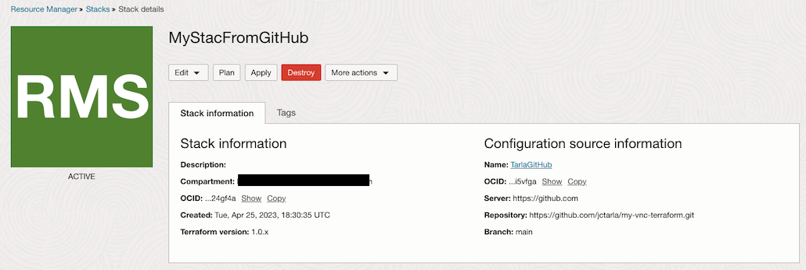

   Click on **Plan** button in order to check what will be created on this stack:  

   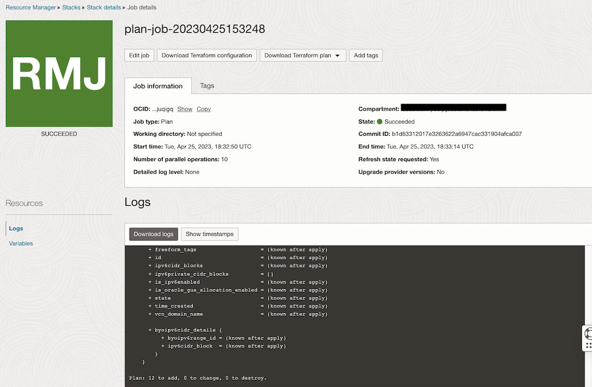
      
   Click on **Apply** button in order to apply the stack: 

   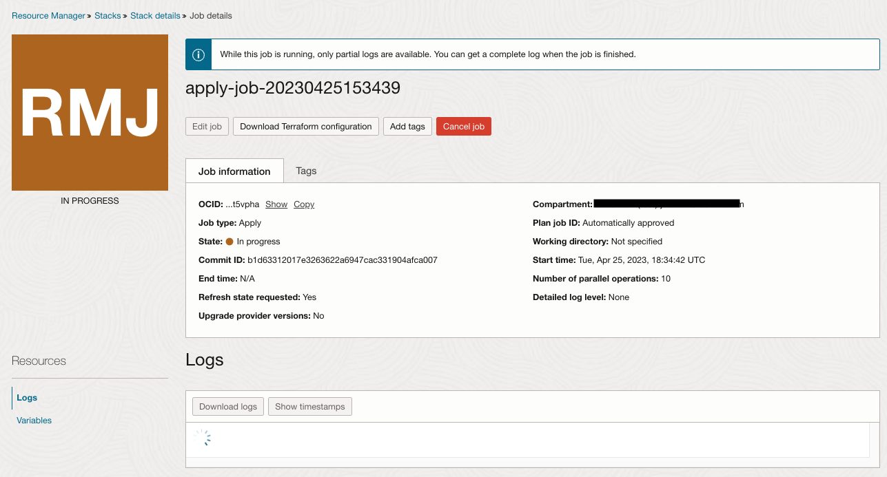  

   Follow up the resource creation on the OCI console page  

   


## Related Links

- [OCI CLI Install and Setup](https://docs.oracle.com/en-us/iaas/Content/API/SDKDocs/cliinstall.htm)

- [Installing Terraform CLI](https://developer.hashicorp.com/terraform/tutorials/oci-get-started/install-cli)
- [Examples using OCI CLI with resource manager ](https://github.com/oracle/oci-cli/blob/master/services/resource_manager/examples_and_test_scripts/resource_manager_example.sh)


## Acknowledgments

* **Author** - Joao Tarla (Oracle LAD A-Team Solution Engineer)  
